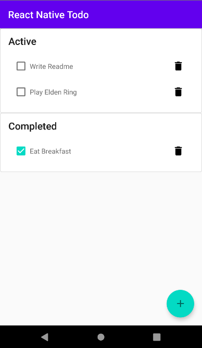

    

<h1 align="center">
    React Native Todo
</h1>

This is a simple React Native application that I built to keep track of tasks, similarly to the [React Todo](https://github.com/shjosa/react-todo) application I built before.

While iOS is included in the code, this project was only tested with Android.

## Screenshot

## Technologies Used
- [React](https://reactjs.org/)
- [React Native](https://reactnative.dev/)
- [React Native Paper](https://reactnativepaper.com/)
- [React Native Default Preference](https://github.com/kevinresol/react-native-default-preference)